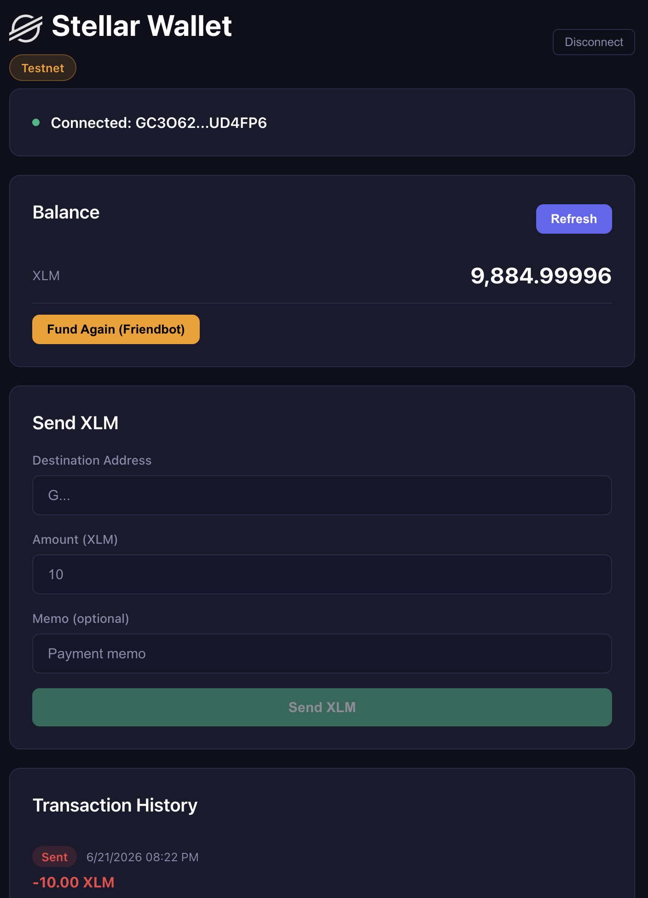
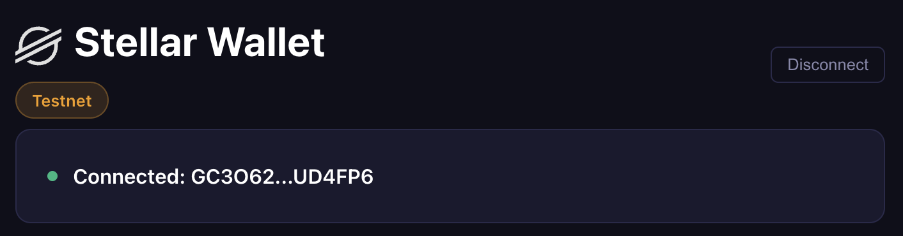
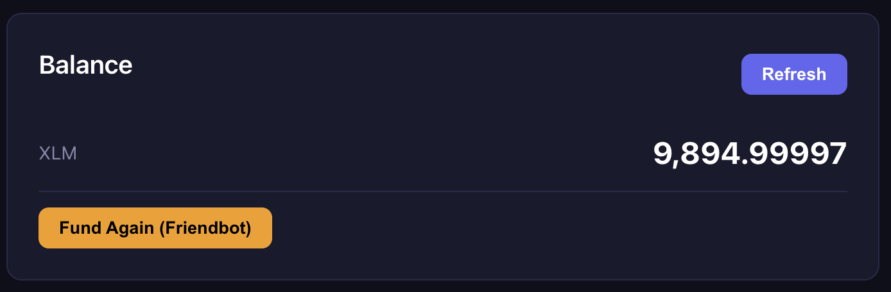
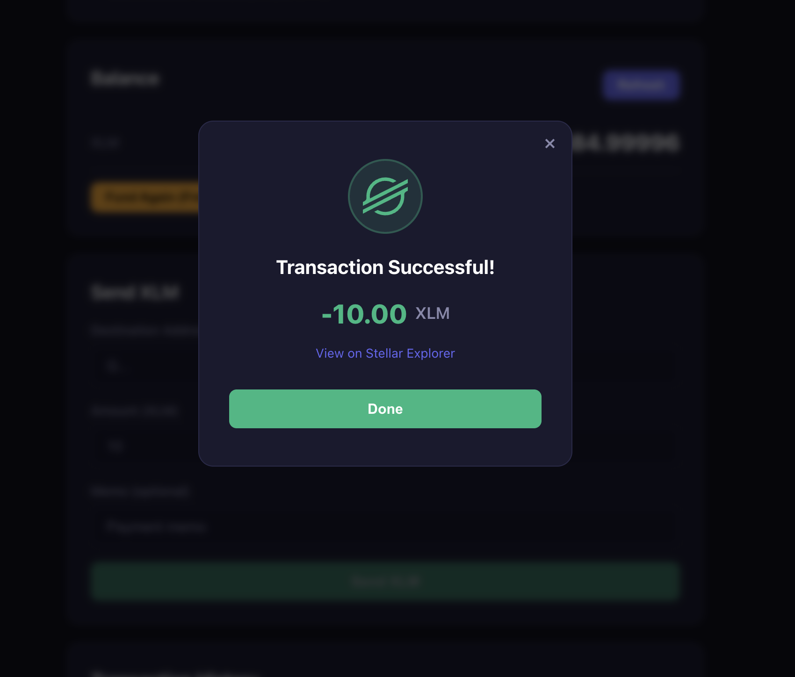
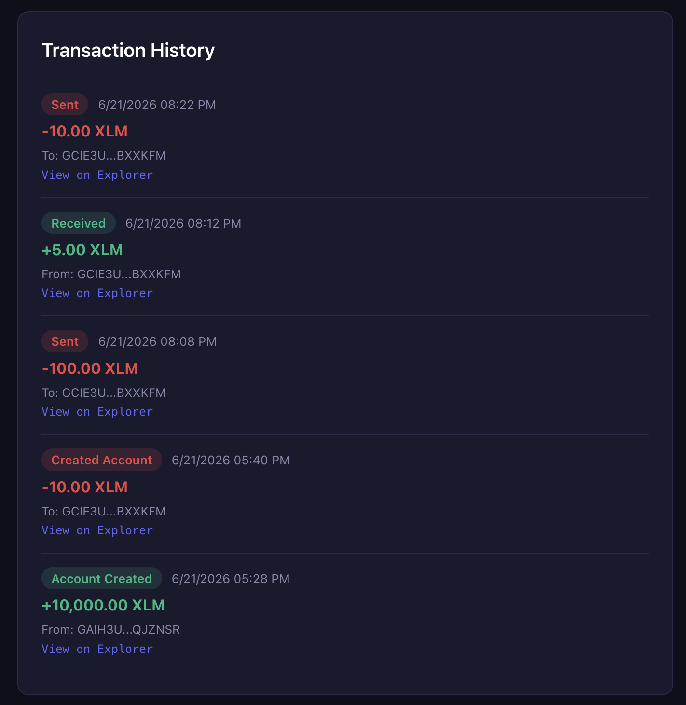

# Stellar White Belt dApp

A Stellar testnet wallet application built for the **Rise In - Stellar Journey to Mastery** Level 1 White Belt challenge.

## Features

- **Wallet Connection** — Connect via Freighter browser wallet
- **Fund Wallet** — One-click funding via Stellar Testnet Friendbot (10,000 XLM)
- **Balance Display** — View all asset balances in real-time
- **Send XLM** — Send XLM to any Stellar address on testnet (handles both existing and new accounts)
- **Transaction History** — View recent transactions with status, amounts, and explorer links

## Tech Stack

- React + TypeScript + Vite
- Stellar SDK (`@stellar/stellar-sdk`)
- Freighter Wallet API (`@stellar/freighter-api`)

## Prerequisites

- [Bun](https://bun.sh/) (package manager)
- [Freighter Wallet](https://www.freighter.app/) browser extension (set to **Testnet**)

## Setup & Run Locally

```bash
cd level-1-white-belt
bun install
bun dev
```

Open `http://localhost:5173` in your browser.

## How to Use

1. Install the Freighter browser extension and switch to **Testnet**
2. Click **Connect Freighter** to connect your wallet
3. Click **Fund with Testnet Friendbot** to receive 10,000 test XLM
4. Enter a destination address and amount to **Send XLM**
5. View your transactions in the **Transaction History** section

## Screenshots



### Wallet Connected


### Balance Displayed


### Successful Transaction


### Transaction Result


## Live Demo

Deployed via GitHub Pages: [View Live](https://serkantoraman.github.io/stellar-belt-progression/)
